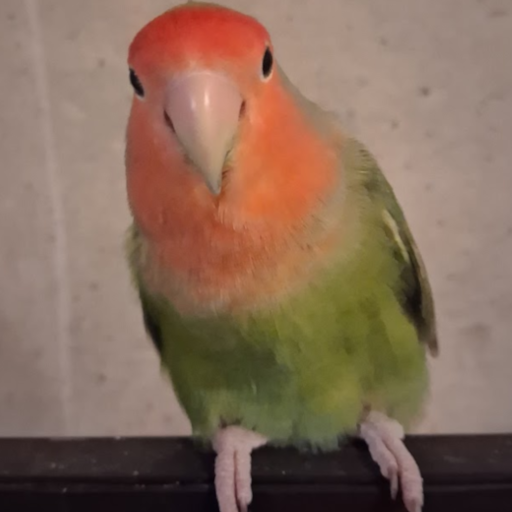

# Felix Terminal

[](https://get.microsoft.com/installer/download/9ns1cjk9vt7q?referrer=appbadge)

### Install

**Windows (winget):**
```
winget install "Felix Terminal"
```
This installs directly from the Microsoft Store listing above via winget's `msstore` source, so it stays up to date the same way Store installs do.

**Windows (manual):** download the `.msi` from the [Releases](../../releases) page. Same code as the Store/winget version, but installed this way it won't auto-update — you'll need to grab new releases manually. *(The `.msix` in Releases is unsigned and won't install directly outside the Store — use the MSI instead for manual installs.)*

**Linux:** build from source — see [Building](#building) below.




*Felix — the chaos birdie himself*

## The Story Behind the Name

Felix Terminal is named after Felix, a lovebird whose life was tragically cut short. Felix had a particular fondness for perching on top of computer monitors and supervising whatever was happening on screen — and occasionally causing as much mischief as a small bird possibly could. In his honor, this terminal carries his name. Every time it opens, a little chaos birdie lives on.

Rest easy, Felix. 🐦

---

A standalone OpenGL terminal emulator for Linux and MS Windows with SDL fallback for rendering (some shaders in SDL are CPU rendered so they are slow). Renders text using FreeType triangles via OpenGL 3.3 — no GTK, no Qt, no desktop toolkit dependency.

## Features

- VT100/VT220/xterm-compatible emulation
- Full 256-color and 24-bit RGB color support
- Font variants: Regular, Bold, Italic, Bold Italic (DejaVu Sans Mono)
- Text attributes: bold, italic, underline, strikethrough, overline, dim, blink, reverse
- Emoji rendering via embedded NotoEmoji (fallback for non-ASCII glyphs)
- Scrollback buffer (5000 lines)
- Mouse reporting (X10 and SGR encoding)
- Bracketed paste mode
- Alternate screen buffer (used by vim, less, etc.)
- Configurable themes and window opacity
- Spawn additional terminal windows
- Works with /bin/bash, cmd.exe, powershell, and many more
- Kitty Graphics Support with Animated GIF Support e.g. timg icon.png — Windows support untested
- URL detection with Ctrl+Click to open in browser
- System font selection from any installed monospace font
- Includes Felix BASIC

## SSH Support (build with `-DUSESSH`)

- Built-in SSH client via **libssh2** — no external SSH binary required
- Authentication: SSH agent (including **Pageant** on Windows), public key file, and password
- **CAC/PIV smart card support** via Pageant — works out of the box with standard DoD/government PKCS#11 middleware (e.g. OpenSC feeding keys into Pageant)
- Host key verification against `~/.ssh/known_hosts`
- Ed25519, ECDSA, and RSA host key types supported
- Keepalive to prevent server-side idle disconnect
- PTY resize forwarded to remote on window resize
- Password prompt rendered natively inside the terminal window (no external dialog)
- Launch with `--ssh [user@host[:port]]` or via the **New Terminal → SSH Session** context menu item

## SFTP File Transfer

- Integrated graphical SFTP browser — no separate client needed, old-school dual-pane "Norton Commander"-style file copy screen (no drag-and-drop — you navigate each pane and select what to transfer)
- **F2** — Upload: left panel browses local files, right panel browses remote destination
- **F3** — Download: right panel browses remote files, left panel selects local destination
- **F4** — SFTP Console
- **F5** — Eye of Felix (let's you view remote and local image and listen to audio, including Karaoke CD+G files)
- **F6** — Local and remote port fowarding console
- Tab switches focus between panels; Enter opens directories; Backspace navigates up; Space transfers
- Real-time progress bar with bytes transferred / total during upload and download
- Transfers run on a background thread — terminal remains responsive during large file transfers
- Remote working directory auto-detected via `pwd` on session open
- Downloads saved to user-chosen local directory (defaults to `~/Downloads/FelixTerminal`)
- SFTP subsystem shares the existing SSH session — no second connection or re-authentication

### SFTP Web Browser (F12, from within the F4 console)

- **F12** — while inside the **F4** SFTP Console, starts a local web server exposing the remote filesystem as a browsable file listing at `http://localhost:53716`. F12 does nothing outside of the F4 console.
- Port `53716` spells **FELIX**: F→5, E→3, L→7 (upside-down L), I→1, X→6
- Binds to `127.0.0.1` only — it's reachable from the local machine, not other devices on the network, so there's nothing to expose or firewall
- If port `53716` is already in use, it automatically tries the next port up (to `53815`) — check the terminal log output for the actual port if it had to fall back
- Browse directories, sort by name/type/size/modified, and upload/download files straight from a browser tab — handy for quick access without opening the F2/F3 panels
- Each browser request runs on its own thread against its own SFTP subsystem, so a large transfer through the web browser won't block the terminal or the F4 console
- "Open in new window" checkbox in the browser UI controls whether clicking a file opens a new tab or navigates the current one — persisted as a cookie
- Shuts down automatically when the SSH session ends or the F4 console is closed

## GL Render Modes

Post-process effects applied after terminal rendering — multiple modes can be active simultaneously:

| Mode | Description |
|---|---|
| Normal | Standard rendering |
| CRT | Scanline flicker and phosphor glow |
| LCD | Subpixel grid overlay |
| VHS | Noise, chroma bleed, and tracking artifacts |
| Focus | Vignette darkening outside the active row |
| C64 | Commodore 64 palette and chunky pixel look |
| Composite | NTSC composite color bleeding |

## Dependencies

- SDL2
- OpenGL / GLEW
- FreeType2
- libssh2 *(optional — required for SSH and SFTP support)*

On Fedora/RHEL:
```
sudo dnf install SDL2-devel glew-devel freetype-devel libssh2-devel
```

On Debian/Ubuntu:
```
sudo apt install libsdl2-dev libglew-dev libfreetype-dev libssh2-1-dev
```

## Building

```
make
```

SSH/SFTP support (recommended):
```
make USESSH=1
```

or for Windows (requires mingw):

```
make windows
```

The fonts are embedded as base64-encoded headers — no external font files required.

## Usage

```
./gl_terminal [command]
```

Optionally pass a command to run instead of the default shell:

```
./gl_terminal htop
```

SSH session (opens connection dialog if host/user not specified):

```
./gl_terminal --ssh
./gl_terminal --ssh user@host
./gl_terminal --ssh user@host:2222
./gl_terminal --ssh-key ~/.ssh/id_ed25519 --ssh user@host
```

## Keyboard Shortcuts

| Shortcut | Action |
|---|---|
| `Ctrl+C` (with selection) | Copy selection |
| `Ctrl+Shift+C` (with selection) | Copy selection as HTML |
| `Ctrl+V` | Paste |
| `Ctrl+Shift+V` | Paste |
| `Ctrl+Scroll Up/Down` | Increase / decrease font size |
| `Ctrl+Shift+Scroll` | Increase / decrease font size (4× step) |
| `Ctrl+Click` | Open URL in browser |
| `Shift+PageUp / Shift+PageDown` | Scroll scrollback buffer |
| `F2` | Open SFTP upload browser *(SSH sessions only)* |
| `F3` | Open SFTP download browser *(SSH sessions only)* |
| `F12` | Start SFTP web browser at `localhost:53716` *(inside F4 SFTP Console only)* |
| `F11` | Toggle full screen |


## Mouse

| Action | Behaviour |
|---|---|
| Left click + drag | Select text |
| Release after drag | Auto-copy selection to clipboard |
| Middle click | Paste clipboard |
| Right click | Open context menu |
| Scroll wheel | Scroll scrollback history |
| `Ctrl` + scroll | Resize font |

## Context Menu (Right Click)

- **New Terminal** — spawn a new local terminal window
- **New Terminal → SSH Session** — open a new SSH session window
- **Copy** — copy selection as plain text
- **Copy as HTML** — copy with color and style markup
- **Copy as ANSI** — copy with ANSI escape codes
- **Paste**
- **Reset** — clear screen and reset cursor
- **Themes** — submenu to switch color themes
- **Opacity** — submenu to set window transparency
- **Render Mode** — submenu to toggle GL post-process effects
- **Fonts** — submenu to select from installed system monospace fonts
- **Sound** — enables or disables CRT audio effect
- **Fight Mode** — have two guys fight in your console
- **Bouncing Circle** — a bouncing ball overlay
- **Select All**
- **Quit**

## SSH Command-Line Flags

All `--ssh-*` flags also accept a single-dash form (e.g. `-ssh-key`).

| Flag | Description |
|:---|:---|
| `--ssh [user@host[:port]]` | Connect via SSH. Host and user are prompted inside the window if omitted. Port defaults to 22. |
| `-i <path>` | Private key file (same as `--ssh-key`, matches standard `ssh` convention). |
| `--ssh-key <path>` | Private key file for public key authentication. |
| `--ssh-key-pub <path>` | Public key file. Derived from `--ssh-key` path (appending `.pub`) if omitted. |
| `--ssh-password <pass>` | Password. Not recommended — prefer agent or key auth. |
| `--ssh-known-hosts <path>` | Known hosts file. Default: `~/.ssh/known_hosts`. Set to empty string to skip host verification (insecure). |

## Themes

| Theme | Description |
|---|---|
| Default | Dark blue-black background |
| Solarized Dark | Ethan Schoonover's Solarized palette |
| Monokai | Classic Monokai |
| Nord | Arctic, north-bluish palette |
| Gruvbox | Retro groove palette |
| Matrix | Black background, green text |
| Ocean | Deep blue background |

## Configuration

Runtime configuration is stored in:

- **Linux:** `~/.config/FelixTerminal/`
- **Windows:** Registry

Compile-time defaults are defined at the top of `gl_terminal.h`:

```c
#define TERM_COLS_DEFAULT  80
#define TERM_ROWS_DEFAULT  24
#define SCROLLBACK_LINES   5000
#define FONT_SIZE_DEFAULT  16
#define FONT_SIZE_MIN      6
#define FONT_SIZE_MAX      72
```

## Embedded Fonts

| File | Font |
|---|---|
| `DejaVuMono.h` | DejaVu Sans Mono Regular |
| `DejaVuMonoBold.h` | DejaVu Sans Mono Bold |
| `DejaVuMonoOblique.h` | DejaVu Sans Mono Oblique |
| `DejaVuMonoBoldOblique.h` | DejaVu Sans Mono Bold Oblique |
| `NotoEmoji.h` | Noto Emoji (grayscale fallback) |

To regenerate a font header, base64-encode the TTF and wrap it with the expected macro name and size constant (see any existing `.h` for the format).
